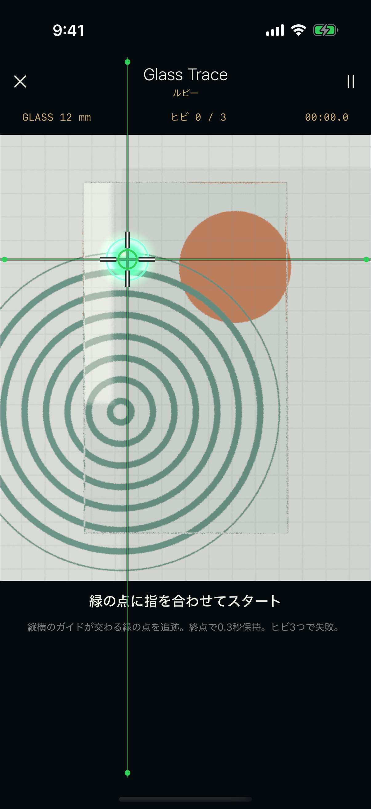
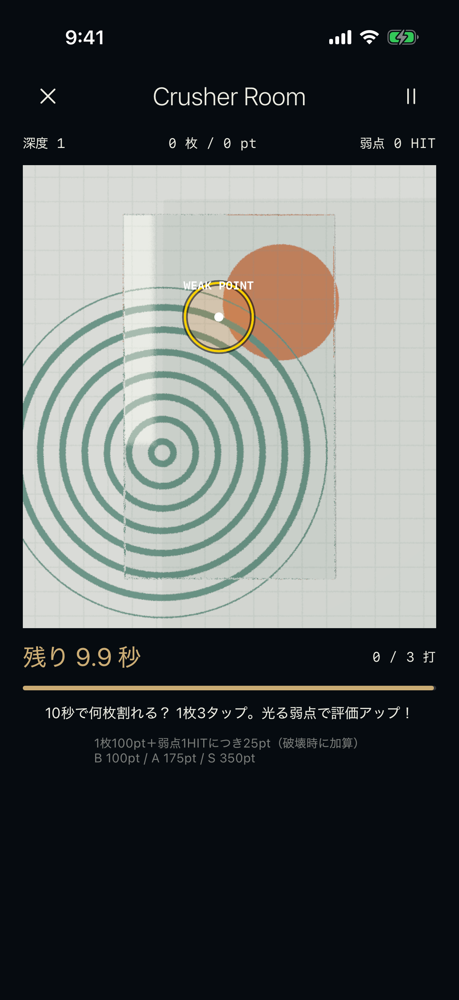

# Crusher 10秒チャレンジとRubyガイド

2026-09-21 / 0.4.1（ビルド4）。人間からの追加指示を反映。第4版Excelの旧Crusher「5枚ごとの連続報酬」は、この仕様に置き換える。Excelそのものは変更しない。

## Crusher Room

3秒カウントダウンと初回描画準備後、自動的に10秒計測を開始する。最初のタップを待ってタイマーを延ばさない。1枚は3タップ、破壊後は次のガラスが自動出現。10秒が尽きたら入力を止め、枚数・弱点命中数・得点・B/A/S評価と報酬を表示。「もう一度・10秒」で次のチャレンジへ進む。

ガラスごとにランダムな位置へ黄色いWeak Pointを表示する。1枚破壊で100pt、そのガラスへの弱点命中1回につき25ptを破壊時に加算。最大175pt/枚。未破壊のガラスへの命中はHIT数には残るが、報酬判定用の得点には加算しない。1回のtouch-downにつき1打、多指による重複と120ms未満の連打は受け付けない。Weak Pointの輪郭と判定は同じガラス座標・半径を使う。

| 深度 | 弱点半径（ガラス幅比） | B / クリア | A | S |
| --- | --- | --- | --- | --- |
| 1 | 0.160 | 100 | 175 | 350 |
| 2 | 0.140 | 200 | 275 | 500 |
| 3 | 0.120 | 300 | 400 | 650 |
| 4 | 0.100 | 450 | 525 | 800 |
| 5 | 0.085 | 600 | 650 | 950 |
| 6 | 0.070 | 750 | 775 | 1100 |

全深度とも10秒。高深度では弱点が小さくなり、必要得点が上がる。B未満は報酬なし。例えば深度6で5枚を普通に割ると500ptで未達、同じ5枚の全15打が弱点なら875ptでAになる。数値はプレイ調整用の初期設定。カラット報酬表・購入による深度制限は第4版を維持する。

計測は単調増加時計。破壊演出と次ガラスの登場時間も10秒に含め、OS中断・再開カウントダウンは除く。破壊後の切替を固定0.4秒にし、GPUの描画完了通知で早く切り替えない。10秒ちょうど以降の入力は加点しない。期限前の端末イベントが遅れて届き、すでに結果が確定していた場合は採用しない。極端なメインスレッド負荷時の操作感は実機で継続評価する。

結果はrulesVersion 5で、枚数・命中数・得点も保存する。S3連続は同じ宝石・同じルール版で数え、旧CrusherのSを新ルールの20ct条件へ混ぜない。報酬は結果IDで一度だけ保存し、保存できるまで次のラウンドの開始を禁止する。

途中復帰は `crusher-timed-checkpoint.json`。旧ルールの `crusher-checkpoint.json` は変更せず残すが、新しい10秒チャレンジの進行へは流用しない。すでに取得済みの宝石・記録は保持する。旧ルールの未完了5枚は新ラウンドとして始める。

## Ruby / Glass Trace

緑のターゲットを中心に、白い十字カーソル・緑の円・画面内の左端から右端までの水平線・上端から下端までの垂直線を重ねる。端の緑マーカーも同じ位置に追従するので、指が交点を覆ってもX/Yの位置が分かる。

Metalのガラス描画とタッチ判定に対応する同じ投影計算を使い、SwiftUI Canvasでガイドを描く。ガイドはタッチを受け取らず、元のガラスへ入力を通す。待機・プレイ中だけ表示し、停止・カウントダウン・結果では消す。許容距離・ヒビ・ルビーの報酬条件は変更しない。

## 画面確認

## 検証結果

最終ユニットテスト37件成功。UIテスト5件（リング、クルクル、Ruby入力とガイド、Crusher10秒終了と報酬保持、課金未設定時の制限）成功。最後の深度目標調整後にもユニット37件とCrusherのUIを再実行して成功。Core/Rulesの4,849 assertionsも成功。最初の試行で10秒ちょうどの浮動小数点誤差を検出し、期限比較に微小許容差を入れて修正した。

Rubyの描画位置とガラスの入力座標を、幅335pt/480ptの両方で往復検証。シミュレーターのガイド・弱点・結果画面を画像でも確認した。

iPhone 12 miniへ0.4.1（ビルド4）を上書きインストールして起動。従来と同じ端末保存のDebug確認版で、CloudKit同期は無効。更新前セーブは `/private/tmp/tamor-before-weakpoint` へ退避。ユーザーの宝石データを初期化していない。

テスト記録：`/private/tmp/tamor-weakpoint-verified.xcresult` と `/private/tmp/tamor-weakpoint-final.xcresult`。実機ビルドログ：`/private/tmp/tamor-weakpoint-iphone.log`。難度の数値と長時間の実機負荷は、人間のプレイ感を見て調整する。
