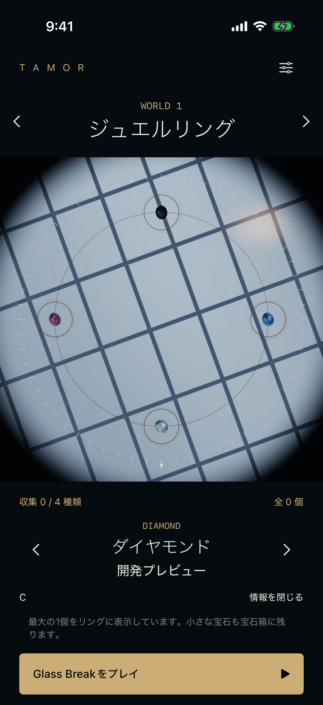
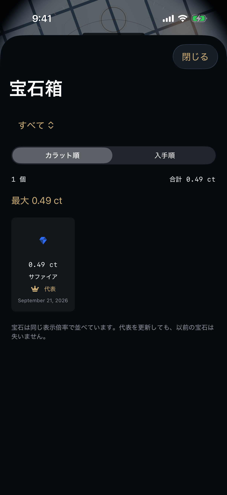
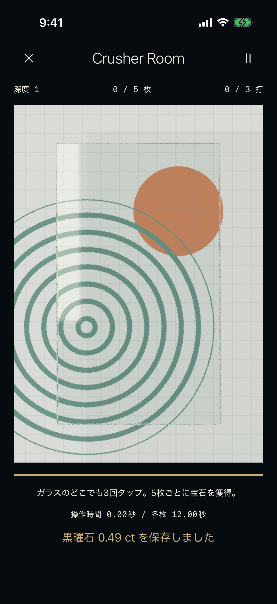

# 第4版の実装・検証記録

2026-09-21 / 基点238f744 / ブランチ `codex/carat-worlds-crusher`。

## 実装済み

- 0.10〜20.00ctの個体保存、深度とB/A/S報酬、20ctのS3連続条件、無料3ct上限。
- World 1の4種とゲーム対応、12固定枠、情報表示時の拡大廃止、宝石箱、World 2予告。
- 小個体・旧オニキス/エメラルドを保持する移行。安定IDによる重複排除、保存失敗時の再試行。
- Crusherの連続出現、3打×5枚、時間切れ継続、報酬保存、途中終了とチェックポイント復帰。
- サファイア・黒曜石の材質、選択中の1個へのRT適用、通常描画へのフォールバック。
- RevenueCat SDK・購入・復元UIと権利による開始制限。CloudKitの取得・競合併合・保存コード。

## 実行結果

| 検証 | 結果 |
| --- | --- |
| Core/RulesのCLI検証 | 4,341 + 508 = 4,849 assertions成功 |
| iOSユニット / セッション / GPUテスト | 最終32件成功、失敗0 |
| UI：固定サイズ・情報・宝石箱・World 2 | 成功 |
| UI：サファイア4×4→報酬→再起動保持→6×6 | 成功 |
| UI：Crusher5枚→報酬→自動継続→退出後保持 | 成功 |
| UI：課金未設定時の解放防止・Simulator RT非対応 | 成功 |
| Simulator Debugビルド | 成功、iPhone 17 Pro / iOS 26.5 |
| 実機向けRelease（署名なし） | コンパイル成功 |
| 実機署名ビルド | CloudKitコンテナと既存プロファイルの不一致で停止 |
| RevenueCat実商品購入 / CloudKit実通信 | 外部設定待ち、未検証 |

UIは最初の一括実行でCrusherのボタンがListの画面外にありテスト補助処理が失敗。スクロールしてからタップするようテストを修正し、Crusher単独の再実行で成功した。他3件は一括実行で成功。最後の中断復帰修正はユニットテストを追加して32件で再検証した。保存先への書き込み失敗時に報酬を付与しないこと、復旧後に一度だけ付与することも確認済み。

1万個体の保存・復元は検証済み。1万個を所持した実機のスクロール性能は未測定。宝石箱は可視セルのみを遅延表示し、代表選択をセルごとに繰り返さない。

## 画面確認

リング、宝石箱、Crusherのスクリーンショットを視認した。以下はテスト専用保存領域の画像で、ユーザーのコレクションではない。

## 設定待ち・実機で残る検証

[接続手順](release-setup-v4.md)にRevenueCat公開キー、商品/権利/Offering、CloudKitコンテナ関連付け、プロビジョニング更新、Productionスキーマ、購入とデータ復元のテスト手順を記載。Simulator結果でiPhone 12 miniの性能・発熱・課金・クラウドの動作を保証しない。新ビルドの実機導入、TestFlight、審査提出は未実施。

一時的な詳細ログ：`/private/tmp/tamor-v4-recovery.log`、`/private/tmp/tamor-v4-recovery.xcresult`、`/private/tmp/tamor-v4-ui.xcresult`、`/private/tmp/tamor-v4-crusher-ui.xcresult`、`/private/tmp/tamor-v4-device.log`、`/private/tmp/tamor-v4-sign.log`。一時ファイルは将来消去される可能性がある。

## 追記：iPhone 12 miniへのインストール（2026-09-21 07:24 JST）

接続中のiPhone 12 miniへ0.4.0（ビルド3）のDebug端末保存確認版を上書きインストールし、起動後の実行プロセスを確認。既存の保存をMacへバックアップしてから更新し、端末内の保存がschema 2から3へ移行し、旧宝石種別が保持されていることも確認した。

CloudKitのコンテナ権限が未登録のため、今回はDebug専用 `TAMOR_LOCAL_DEVICE` 条件で同期を止め、署名時のCloudKit Entitlementsを外している。通常ビルドのCloudKitコードと設定は維持。実機iCloud同期・RevenueCat購入・継続GPU性能は未検証。ビルドログは `/private/tmp/tamor-iphone-local.log`、更新前のセーブバックアップは `/private/tmp/tamor-iphone-before-v4`。
